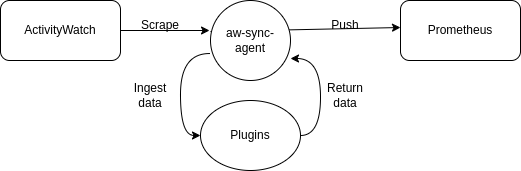

<h1 align="center">aw-sync-suite-plugins</h1>

   

  

## 🔍 About
This is a Repository that hosts the plugins of aw-sync-suite [Agent](https://github.com/phrp720/aw-sync-suite/blob/master/aw-sync-agent/README.md).For versions of aw-sync-suite  >= 0.1.3

Plugins of aw-sync-suite Agent are used to extend the functionality of the agent. The plugins are written in Go and are executed by the agent during the aggregation stage.

## ⚙️ How It Works

When the `aw-sync-agent` starts, it initializes the chosen plugins specified in the configuration. The workflow is as follows:

1. **Initialization**: 
   - Upon startup, the agent reads the `aw-sync-settings.yaml` file to identify which plugins are enabled.
   - Each plugin is initialized according to its specific requirements, preparing it for data processing.

2. **Data Synchronization**:
   - At every sync cycle, the agent collects data from the local ActivityWatch instance.
   - The collected data is then passed through the initialized plugins sequentially.

3. **Data Processing**:
   - Each plugin processes the data according to its defined functionality (e.g., filtering, transformation).
   - After processing, the plugins return the final dataset that has been modified or filtered as per the plugin logic.

4. **Data Push to Prometheus**:
   - The final processed data is then securely pushed to the Prometheus database using the remote-write feature.

This modular approach allows for flexible and customizable data processing, ensuring that only the desired data is sent to Prometheus while maintaining the integrity and confidentiality of sensitive information.

#### flow-diagram:

   

## 🔌 Available Plugins

| Plugin    | Description                       | Has Config | Config File              | Documentation                                                       |
|-----------|-----------------------------------|------------|--------------------------|---------------------------------------------------------------------|
| `filters` | Filters the data of ActivityWatch | ✅          | `aw-plugin-filters.yaml` | [📄](https://github.com/phrp720/aw-sync-suite-plugins/wiki/Filters) |

## 🛠️ How to create a plugin

For instructions on creating a plugin, please refer [here](https://github.com/phrp720/aw-sync-suite-plugins/wiki/%F0%9F%93%9D-How-to-Create-a-Plugin).

## 🔗 How to integrate a plugin

For instructions on integrating a plugin, please refer [here](https://github.com/phrp720/aw-sync-suite-plugins/wiki/%F0%9F%9B%A0%EF%B8%8F--How-to-Integrate-a-Plugin).

## 📝 License

This project is licensed under the **MIT license**.

See [LICENSE](https://github.com/phrp720/aw-sync-suite/blob/master/LICENSE) for more information.
